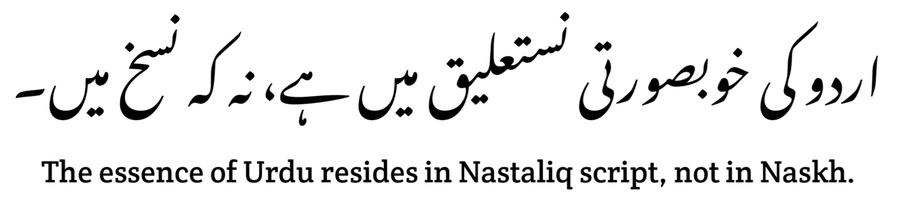

# Noto Nastaliq Urdu

## Noto Nastaliq Font Module for Urdu Users

* Tested on Android 7 and 13,14,15, it will work on every Android device that has secondary and primary language options. Watch the [video](https://youtu.be/2xI-Kagl1yI?si=ja5x8huKUiWJnF9J&t=46) to learn how to check, including OneUI, OxygenOS, and all AOSP-based ROMs.

> [!Important]
>
> If you want to use Nastaliq on a Non-Rooted Device, click [here](https://github.com/Hassan-kareem/Nastaliq-Urdu_font/tree/Non-Rooted)

## Installation

1. **Download:** Obtain the latest zip from Releases: [Noto Nastaliq Urdu](https://github.com/Hassan-kareem/Nastaliq-Urdu_font/releases/download/NotoNastaliq-v3.0/NotoNastaliqUrdu-v3.0.zip), [Kasheeda](https://github.com/Hassan-kareem/Nastaliq-Urdu_font/releases/download/Noori-Kasheeda-v5.0/Nastaliq-Urdu_Kasheeda-v5.0.zip) or [Regular](https://github.com/Hassan-kareem/Nastaliq-Urdu_font/releases/download/Noori-Regular-v5.0/Nastaliq-Urdu_Regular-v5.0.zip), [Mehr Nastaliq](https://github.com/Hassan-kareem/Nastaliq-Urdu_font/releases/download/MehrNastaliq-v3.0/Mehr_Nastaliq-Urdu-v3.0.zip)
2. **Flash:** Install the downloaded file using Magisk or KernelSU.

> [!NOTE]
> Use the [alternative](https://github.com/Hassan-kareem/Nastaliq-Urdu_font/releases/download/NotoNastaliqUrdu-alt/NotoNastaliqUrdu-alt.zip) module if your device doesn't support multiple language options.

## Add Urdu Language

1. Go to `Settings > Languages and input > Languages`.
2. Add Urdu language.
Use The Jameel Noori Nastaliq module, enjoy the beauty and convenience of Urdu on your Android device!

## Screenshots
* Noto Nastaliq Urdu  

### Good News! Say goodbye to font issues like this 👇

### Credit
Me (Hassan Karim)
